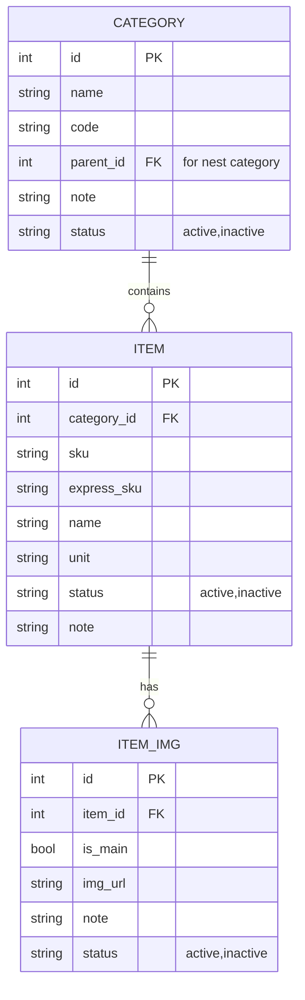

```mermaid
erDiagram

    CATEGORY {
        int id PK
        string name
        string code
        int parent_id FK "for nest category"
        string note
        string status "active,inactive"
    }

    ITEM {
        int id PK
        int category_id FK
        string sku
        string express_sku
        string name
        string unit
        string status "active,inactive"
        string note
    }

    ITEM_IMG {
        int id PK
        int item_id FK
        bool is_main
        string img_url
        string note
        string status "active,inactive"
    }

    CATEGORY ||--o{ ITEM : "contains"
    ITEM ||--o{ ITEM_IMG : "has"
```