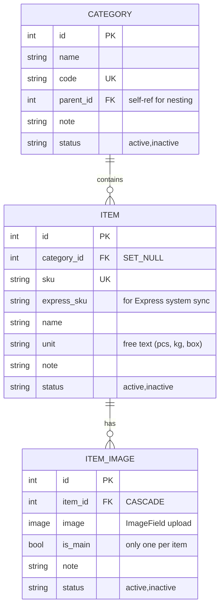

```mermaid
erDiagram

    CATEGORY {
        int id PK
        string name
        string code UK
        int parent_id FK "self-ref for nesting"
        string note
        string status "active,inactive"
    }

    ITEM {
        int id PK
        int category_id FK "SET_NULL"
        string sku UK
        string express_sku "for Express system sync"
        string name
        string unit "free text (pcs, kg, box)"
        string note
        string status "active,inactive"
    }

    ITEM_IMAGE {
        int id PK
        int item_id FK "CASCADE"
        image image "ImageField upload"
        bool is_main "only one per item"
        string note
        string status "active,inactive"
    }

    CATEGORY ||--o{ ITEM : "contains"
    ITEM ||--o{ ITEM_IMAGE : "has"
```