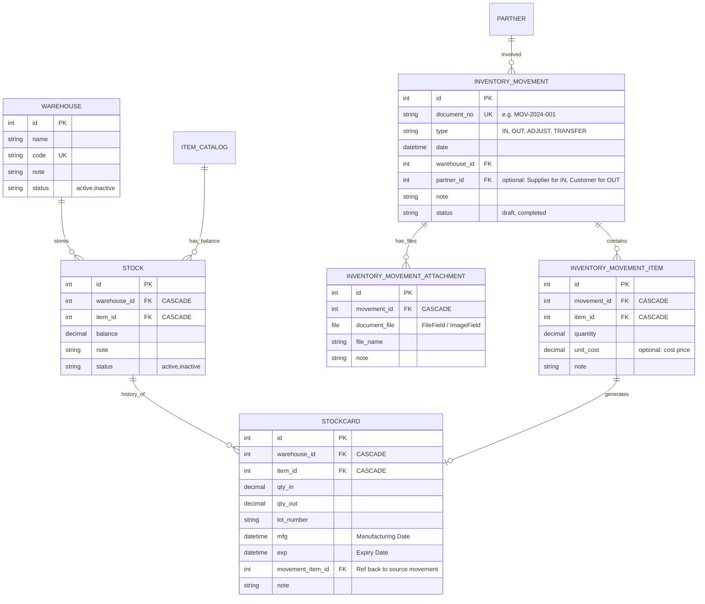

```mermaid
erDiagram

    WAREHOUSE {
        int id PK
        string name
        string code UK
        string note
        string status "active,inactive"
    }

    %% Stock balance
    STOCK {
        int id PK
        int warehouse_id FK "CASCADE"
        int item_id FK "CASCADE"
        decimal balance
        string note
        string status "active,inactive"
    }

    %% Transaction history for each item in each warehouse
    STOCKCARD {
        int id PK
        int warehouse_id FK "CASCADE"
        int item_id FK "CASCADE"
        decimal qty_in
        decimal qty_out
        string lot_number
        datetime mfg "Manufacturing Date"
        datetime exp "Expiry Date"
        int movement_item_id FK "Ref back to source movement"
        string note
    }

    %% Header Table: The Document
    INVENTORY_MOVEMENT {
        int id PK
        string document_no UK "e.g. MOV-2024-001"
        string type "IN, OUT, ADJUST, TRANSFER"
        datetime date
        int warehouse_id FK
        int partner_id FK "optional: Supplier for IN, Customer for OUT"
        string note
        string status "draft, completed"
    }

    %% NEW: Uploaded Files (PDF/Images)
    INVENTORY_MOVEMENT_ATTACHMENT {
        int id PK
        int movement_id FK "CASCADE"
        file document_file "FileField / ImageField"
        string file_name
        string note
    }

    %% Detail Table: The Items inside the document
    INVENTORY_MOVEMENT_ITEM {
        int id PK
        int movement_id FK "CASCADE"
        int item_id FK "CASCADE"
        decimal quantity
        decimal unit_cost "optional: cost price"
        string note
    }

    WAREHOUSE ||--o{ STOCK : "stores"
    ITEM_CATALOG ||--o{ STOCK : "has_balance"
    STOCK ||--o{ STOCKCARD : "history_of"
    INVENTORY_MOVEMENT ||--o{ INVENTORY_MOVEMENT_ITEM : "contains"
    INVENTORY_MOVEMENT ||--o{ INVENTORY_MOVEMENT_ATTACHMENT : "has_files"
    INVENTORY_MOVEMENT_ITEM ||--o| STOCKCARD : "generates"
    PARTNER ||--o{ INVENTORY_MOVEMENT : "involved"
```
