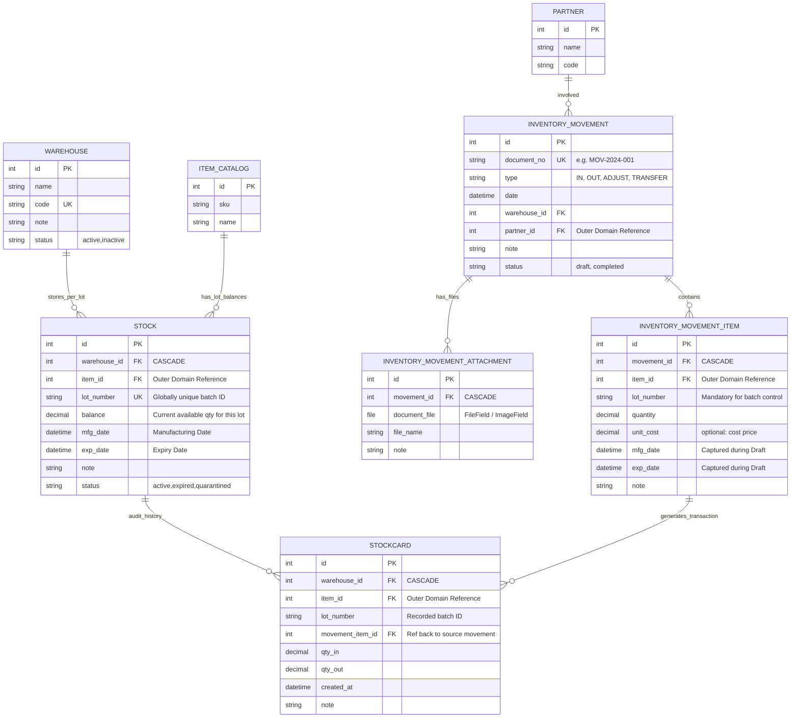

Business Logic: Status Transitions (Draft <-> Completed)
Event: DRAFT -> COMPLETED
   1. Validate: Ensure lot_number, mfg_date, exp_date are present. For OUT, ensure STOCK >= quantity.
   2. Ledger (STOCKCARD): Generate STOCKCARD record mapping 1-to-1 with Movement Item.
   3. Balance (STOCK): Update STOCK balance (increase for IN, decrease for OUT).

Event: COMPLETED -> DRAFT (Reversal)
   1. Validate: For IN reversals, ensure STOCK balance won't drop below zero.
   2. Ledger (STOCKCARD): Delete or reverse generated STOCKCARD entries first.
   3. Balance (STOCK): Reverse the balance change second (decrease for reversed IN, increase for reversed OUT).

Logic: [BALANCE] Total item balance = sum of STOCK.balance where item_id matches.