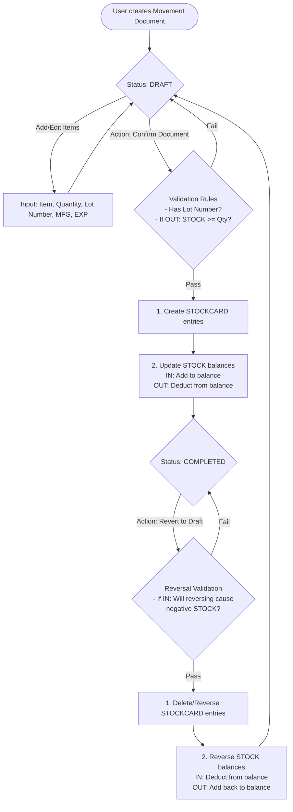

```mermaid
graph TD
    %% Initial State
    Start([User creates Movement Document]) --> Draft{Status: DRAFT}
    
    %% Actions happening while in Draft
    Draft -->|Add/Edit Items| Input[Input: Item, Quantity, Lot Number, MFG, EXP]
    Input --> Draft
    
    %% Forward Transition (Draft -> Completed)
    Draft -->|Action: Confirm Document| Validation{Validation Rules\n- Has Lot Number?\n- If OUT: STOCK >= Qty?}
    Validation -->|Fail| Draft
    
    Validation -->|Pass| Action1_Forward[1. Create STOCKCARD entries]
    Action1_Forward --> Action2_Forward[2. Update STOCK balances\nIN: Add to balance\nOUT: Deduct from balance]
    Action2_Forward --> Completed{Status: COMPLETED}
    
    %% Backward Transition (Completed -> Draft / Cancel)
    Completed -->|Action: Revert to Draft| Reversal_Validation{Reversal Validation\n- If IN: Will reversing cause\n negative STOCK?}
    
    Reversal_Validation -->|Fail| Completed
    
    Reversal_Validation -->|Pass| Action1_Reverse[1. Delete/Reverse STOCKCARD entries]
    Action1_Reverse --> Action2_Reverse[2. Reverse STOCK balances\nIN: Deduct from balance\nOUT: Add back to balance]
    Action2_Reverse --> Draft
```
