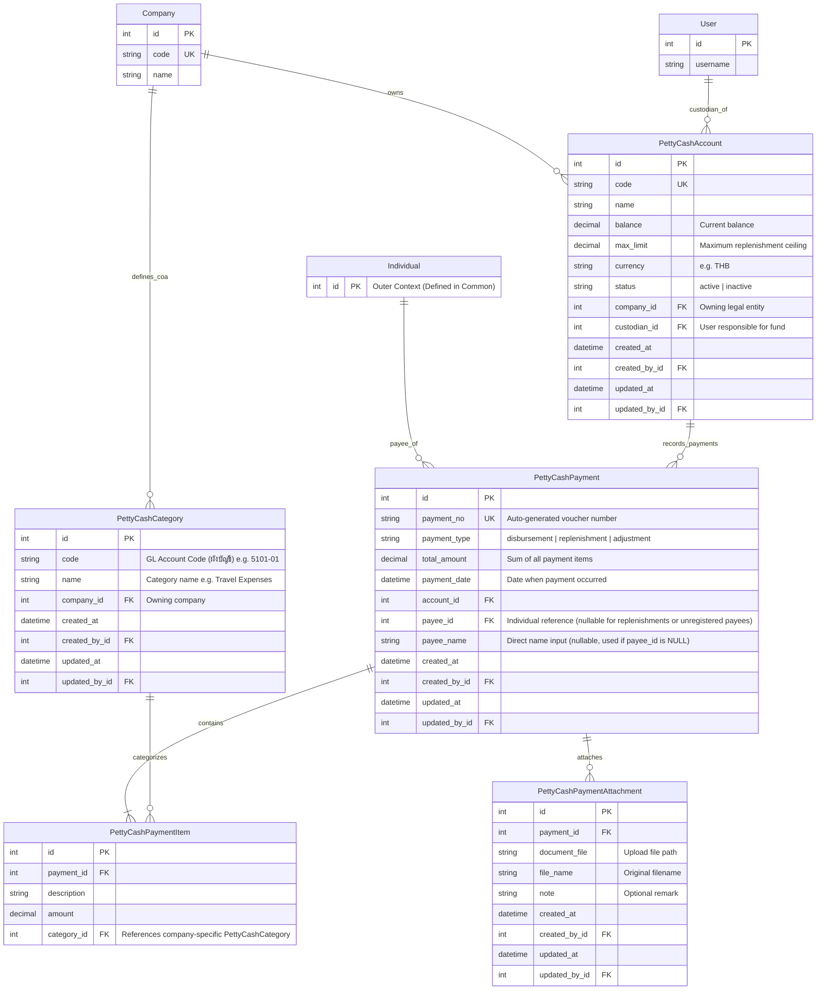

# Entity Relationship Diagram (ERD) - Petty Cash Management

This document defines the database schema design for the `petty_cash` module.

The payment workflow is as follows:
1. The custodian directly enters payment documents (**`PettyCashPayment`**) and their items (**`PettyCashPaymentItem`**) once payments or replenishment actions are fully completed.
2. The payment links to a payee (**`Individual`**). If the payee is not formally registered in the database, the custodian leaves `payee_id` set to `NULL` and manually inputs the name in `payee_name`.
3. A payment document can have multiple uploaded files (**`PettyCashPaymentAttachment`**) representing physical receipts, invoices, or proof-of-payment documents.
4. Each item in a payment voucher must be categorized (**`PettyCashCategory`**), which maps the expense to a specific **Chart of Accounts (ผังบัญชี)** code defined for that company.

---

## ERD (Mermaid Diagram)

---

## Entity Definitions

### 1. `Individual` (Outer Context)
Represents a physical person in the system. To prevent circular dependencies, this is defined globally inside the `common` app.
* **Full Details & Schema**: Refer to the central [Individual ERD](file:///Users/pitsanunamnil/Desktop/work/tj/tj_inventory/django/srcs/common/docs/individual_erd.md) for field definitions (names, email, SQLite-compatible JSON phones array, and user links).

### 2. `PettyCashCategory` (Chart of Accounts / ผังบัญชี)
Represents an expense classification map. 
* **Multi-Company Mapping**: Since each company utilizes its own Chart of Accounts (COA) codes, this model binds a user-friendly expense name and its formal accounting code to a `Company`.
* **Validation**: Items can only select category codes belonging to the same company that owns the parent petty cash account.

### 3. `PettyCashAccount`
A physical or virtual cash box owned by a `Company` and managed by a dedicated custodian (`User`).
* **Balance Tracking**: The balance is adjusted atomically whenever a `PettyCashPayment` is registered (decreased for disbursements, increased for replenishments).

### 4. `PettyCashPayment` (Document Header)
Represents a single completed financial entry (either a payout or a top-up) created by the custodian.
* **Types (`payment_type`)**:
  * `disbursement`: Money paid out. Typically links to a payee (`Individual`) or contains direct text details in `payee_name`.
  * `replenishment`: Money added to top-up the cash box.
  * `adjustment`: Balance corrections.
* **Payee Name Support**: If the payee is not formally registered in the database, `payee_id` is left `NULL`, and the custodian types the name in `payee_name`. If a registered `Individual` is selected, `payee_name` can be left blank (or cached as a historical snapshot).

### 5. `PettyCashPaymentItem` (Document Lines)
Specific line items detailing the payment. A single disbursement document can have multiple lines (e.g. a custodian pays an employee for travel expenses and office supplies in a single cash payout). Each line references a `PettyCashCategory` to map the amount to a specific GL Account code.

### 6. `PettyCashPaymentAttachment`
Stores files associated with a payment document.
* **Traceability**: Inherits `AuditableMixin` to track who uploaded each file. Allows uploading multiple files per payment voucher (e.g. multiple receipts for a split travel/entertainment invoice).

---

## Business Logic: Payment Cancellation (Soft-Delete)

When cancelling (soft-deleting) a payment document, it must inherit from `AuditableMixin` (setting `is_deleted = True`) and reconcile the `balance` in `PettyCashAccount`:

1. **Reversal Direction**:
   - For `disbursement`: Restore the balance (Add the cancelled amount back).
     $$\text{New Balance} = \text{Current Balance} + \text{Payment Amount}$$
   - For `replenishment` / positive `adjustment`: Deduct the balance (Remove the cancelled top-up).
     $$\text{New Balance} = \text{Current Balance} - \text{Payment Amount}$$

2. **Negative Balance Guard**:
   - If subtracting the cancelled replenishment causes the balance to go below zero (`new_balance < 0`), the system must raise a `ValidationError` and block the cancellation.

3. **Concurrency Locking**:
   - Reconciliations must run inside a database transaction (`transaction.atomic`) with row-level locking (`select_for_update`) on the `PettyCashAccount` record to prevent race conditions.
