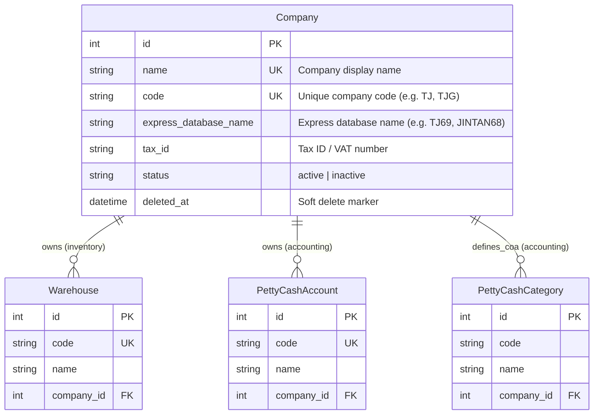

# Entity Relationship Diagram (ERD) - Company Model

This document defines the schema for the central `Company` model located in the `common` app. It represents an internal corporate legal entity.

---

## ERD (Mermaid Diagram)

---

## Entity Definitions

### 1. `Company`
Represents an internal legal entity (subsidiary or company brand) within the multi-tenant system.
* **Database Routing Integration (`express_database_name`)**: Maps the internal entity to its corresponding external Express accounting database name (e.g. `TJ69`), allowing database-driven routing for data synchronization and stock comparisons.
* **Audit & Status Mixins**: Inherits from `AuditableMixin` and `StatusMixin` to support standard soft-deletes (`is_deleted`), active status checks, and audit trails.

### 2. Relationships (Shared contexts)
* **Warehouses** (`inventory` app): Each physical warehouse belongs to a specific legal entity.
* **Petty Cash Box** (`accounting` app): A company owns cash funds and accounts managed by custodians.
* **Chart of Accounts** (`accounting` app): Companies declare their own general ledger categories and accounting codes.
