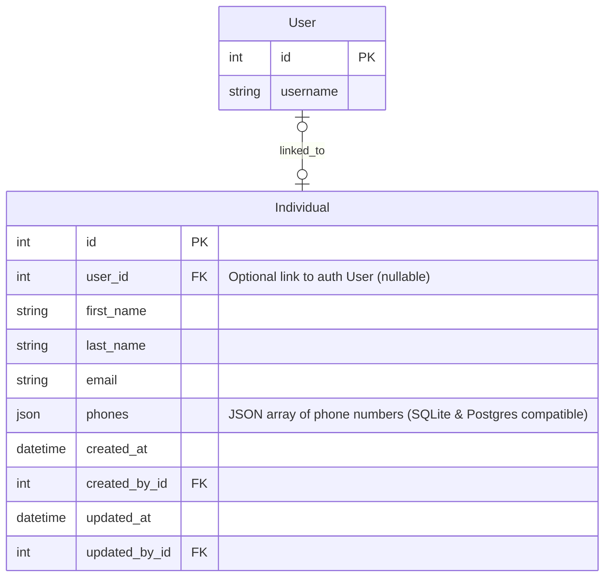

# Entity Relationship Diagram (ERD) - Individual (Person) Model

This document defines the schema for the central `Individual` model located in the `common` app. It represents a physical human being (independent of their business role).

---

## ERD (Mermaid Diagram)

---

## Entity Definitions

### 1. `Individual`
Represents any single physical human being (such as employees, personal customers, or contact persons). 
* **Role Independence**: This table stores core contact and identification details only. System-wide business roles (e.g. employee, vendor contact) are implemented as separate models pointing to this table via `OneToOneField` or `ForeignKey` references.
* **Authentication**: Optional. If the individual needs credentials to log in, they link to the Django `auth.User`. Otherwise, `user_id` is left `NULL`.
* **Phones**: Stored as a JSON array (`JSONField`) to support multiple phone numbers in a cross-database compatible way (compatible with local SQLite and production PostgreSQL).
* **Audit Fields**: Extends `AuditableMixin` for tracking creation and modification metadata.
