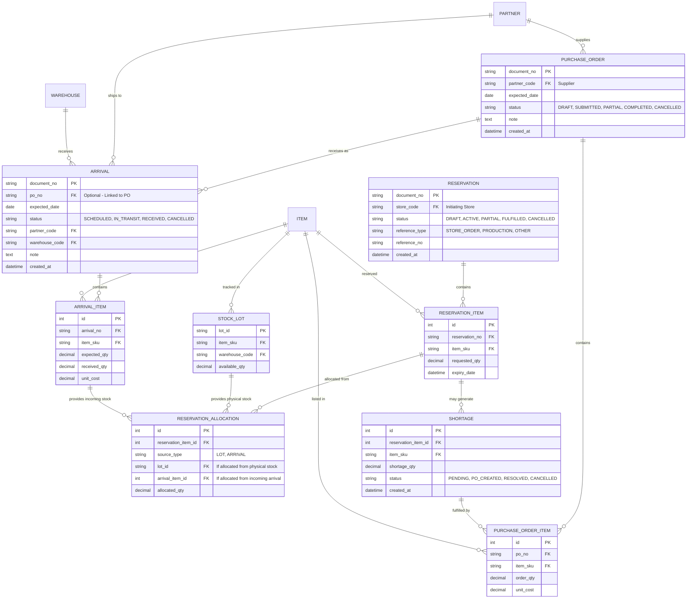

# Procurement Domain ERD

This document outlines the database schema for the Procurement module, focusing on Purchase Orders, Arrivals, Reservations, and Shortage handling.

## Entity Descriptions

### 1. Reservation & ReservationItem
Operates like a "shopping cart". The `Reservation` is the main document (the cart) created by the physical store. It contains multiple `ReservationItem` records (the products in the cart), each representing a request for a specific product and quantity.

### 2. ReservationAllocation
Links the requested quantity to actual supply. An item can be allocated against:
- **Physical Stock (`STOCK_LOT`)**: Items already in the warehouse with `available_qty > 0`.
- **Incoming Stock (`ARRIVAL_ITEM`)**: Items that have been ordered from a supplier and are scheduled to arrive soon.

### 3. Shortage
If the `requested_qty` of a `ReservationItem` cannot be fully met by allocations from `STOCK_LOT` or `ARRIVAL_ITEM`, the system generates a `Shortage` record for the remaining deficit. The Stock Controller monitors these records to group them and create `Purchase Orders`.

### 4. Purchase Order (PO)
The formal request sent to a supplier (Partner) to procure stock. Generated by the Stock Controller to cover identified `Shortage` records or for general inventory replenishment.

### 5. Arrival
Represents a planned or actual shipment from a supplier. It can be linked to a `Purchase Order` and serves as the "Intent" document that will eventually trigger an `InventoryMovement` upon physical receipt.

### 6. ArrivalItem & PurchaseOrderItem
Line items detailing specific products. `ArrivalItem` tracks `expected_qty` versus `received_qty` to easily handle partial deliveries against the original PO.
