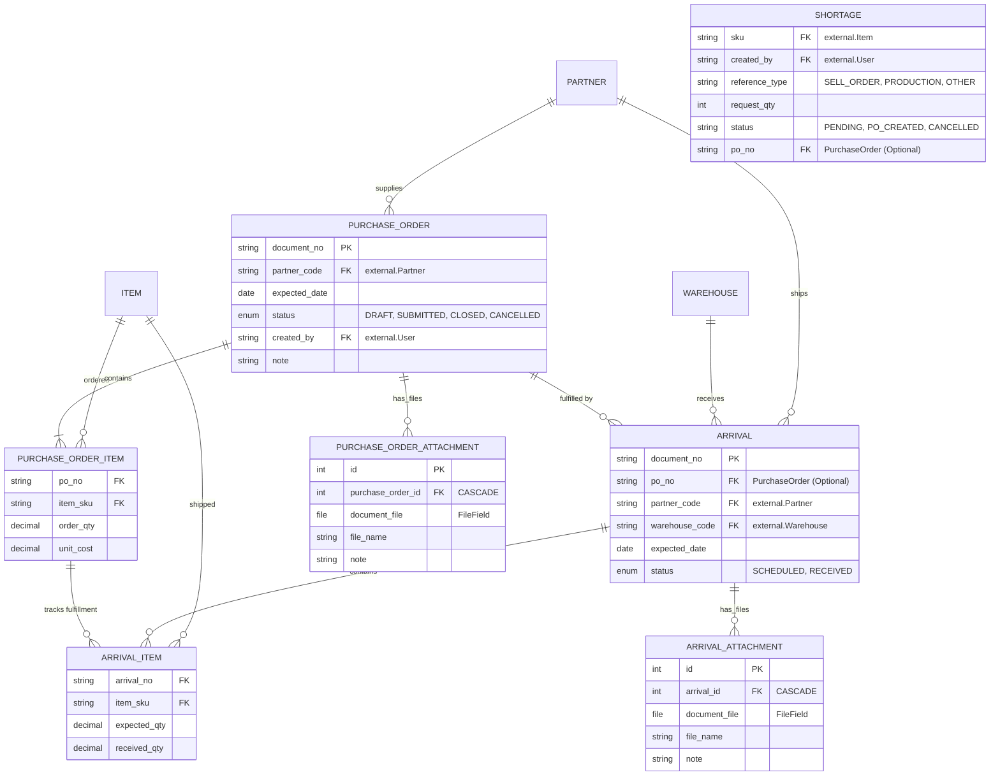

# Procurement ERD: Purchase Orders & Arrivals

This diagram focuses exclusively on the Procurement module's supply-side models.

## Relationship Details

1.  **External References**:
    *   `Partner`: From the `partners` app.
    *   `Item`: From the `catalog` app.
    *   `Warehouse`: From the `inventory` app.
2.  **Purchase Order (PO)**: Represents the contract or intent to buy.
3.  **Arrival**: Represents the actual shipment from the supplier. It can be linked to a `PurchaseOrder` for fulfillment tracking, or be "Standalone" if no PO exists.
4.  **Arrival Item**: Tracks the specific quantities received. If linked to a `PurchaseOrderItem`, it helps calculate "Remaining to Receive" on the PO.
5.  **Attachments**: Both Purchase Orders and Arrivals support multiple file attachments (PDFs, invoice images, packing lists) for audit compliance and record-keeping.
