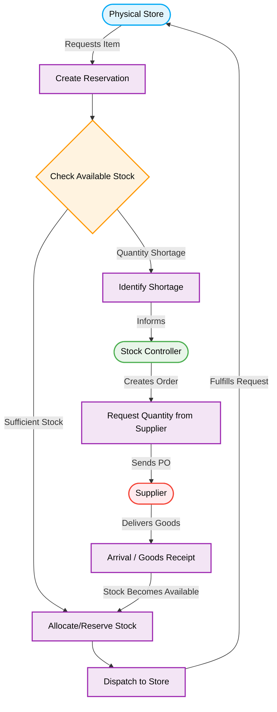

# Procurement & Reservation Workflow

This document outlines the core concepts of the Procurement process, focusing on how store reservations interact with inventory, shortages, and supplier orders based on your description.

## Core Concepts

1. **Reservation**: A request originating from a physical store for specific items.
2. **Shortage**: Occurs when the currently available stock is insufficient to fulfill the reservation quantity.
3. **Stock Controller**: The user role responsible for managing inventory levels and ordering new stock when shortages occur.
4. **Supplier**: The external vendor who provides the requested goods.
5. **Arrival**: The process of receiving goods from the supplier into the inventory system (Goods Receipt).

## Process Flowchart

## Step-by-Step Breakdown

1. **Initiation**: A Physical Store identifies a need and creates a **Reservation** for a specific quantity of an item.
2. **Inventory Check**: The system checks the current stock levels against the requested quantity.
3. **Scenario A: Sufficient Stock**
   - The requested quantity is successfully **Allocated** or reserved for that store.
   - The stock is then picked and **Dispatched** (transferred) to the store.
4. **Scenario B: Shortage Detected**
   - The system flags a **Shortage** because there isn't enough stock to meet the reservation.
   - The **Stock Controller** is automatically informed of the shortage.
   - The Stock Controller reviews the shortage and **Requests Quantity** from the **Supplier** (typically by creating a Purchase Order).
5. **Arrival / Goods Receipt**
   - The Supplier delivers the goods.
   - The warehouse processes the **Arrival**, updating the stock levels.
   - The newly arrived stock is immediately used to fulfill the pending reservation (**Allocate/Reserve Stock**).
