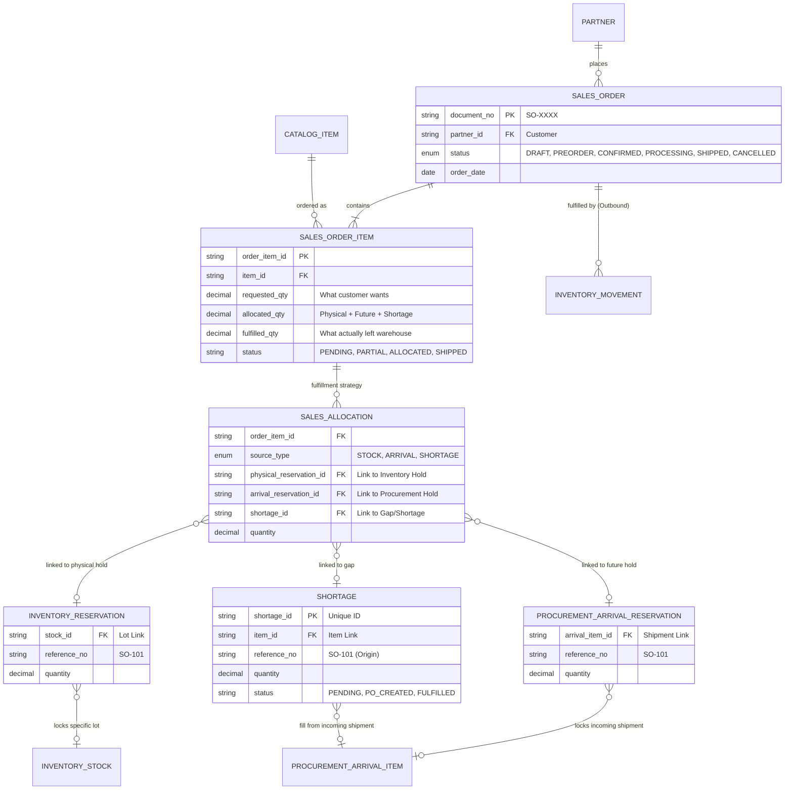

# Sales Module ERD (Triple-Ledger Architecture)

This document defines the highly-decoupled relationship between Sales, Inventory, and Procurement for tracking reservations.

## Team Responsibilities

1. **Warehouse Admin (Inventory)**:
   - Only sees `INVENTORY_RESERVATION`.
   - Knows exactly what is locked on their shelves.
2. **Stock Controller (Procurement)**:
   - Only sees `PROCUREMENT_ARRIVAL_RESERVATION`.
   - Knows exactly how much of an incoming truck is already sold.
3. **Sales Representative (Sales)**:
   - Sees `SALES_ALLOCATION`.
   - Knows the whole picture for the customer.
