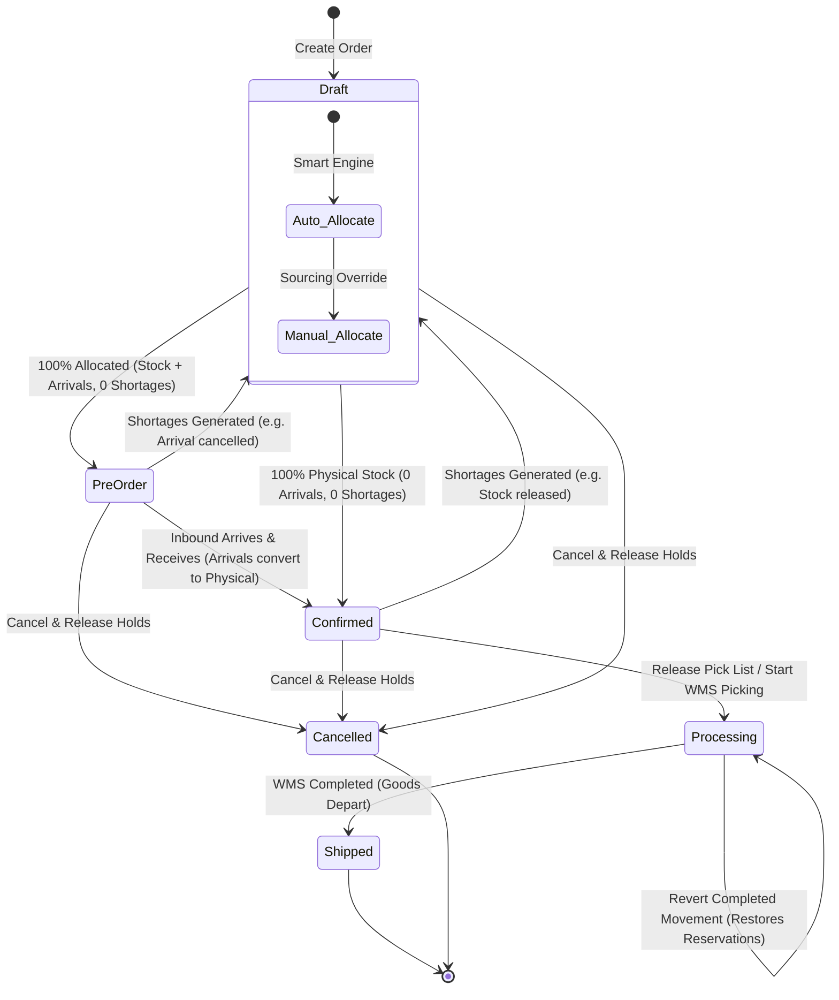
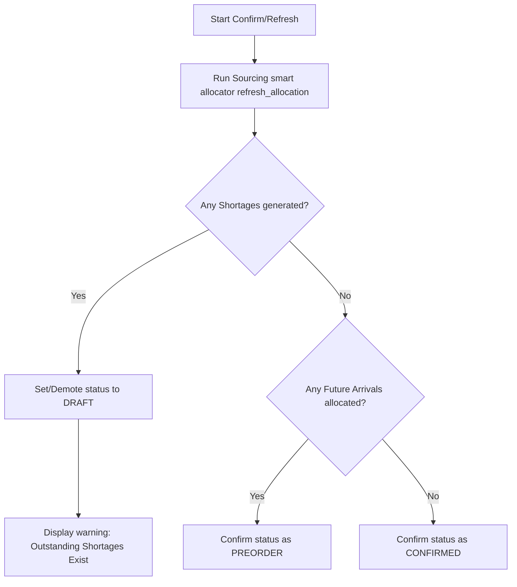

# Sales Order Lifecycle & Status Workflow

This document defines the lifecycle, state transitions, and business rules for the statuses of a Sales Order (`SalesOrder.Status`) in the TJ Inventory system.

---

## 1. Core Status Definitions

### 1. Draft (`draft`)
* **Definition**: The planning, sourcing, and shortage stage. The order is recorded, but it has not yet been committed for warehouse execution.
* **Shortage Gating Rule**: 
  > [!IMPORTANT]
  > If an order has **any outstanding shortages** (meaning the total requested quantity is not fully satisfied by physical stock or scheduled arrivals), the order **MUST remain or be demoted to `DRAFT` status**. Sourcing shortages are not considered fulfillment; therefore, the order cannot transition to `CONFIRMED` or `PREORDER`.
* **Behavior & Actions**:
  * Planners can fully edit order header fields (Customer, note, dates).
  * Planners can add, edit, or delete items inside the shopping cart.
  * The smart allocation engine dynamically matches items to physical stock lots (FEFO), scheduled arrivals, or logs shortages.
  * Planners have full access to the **Manual Sourcing Workspace** to customize holds.
  * The order can be cleanly **Cancelled** at any time.

### 2. Pre-order (`preorder`)
* **Definition**: Sourcing is 100% complete but relies on future incoming inventory. **Every single item line is fully allocated with a combination of actual stock and scheduled procurement arrivals, with EXACTLY ZERO shortages**.
* **Behavior & Actions**:
  * Item edits and quantities are locked.
  * Scheduled expected arrivals are reserved to this order document.
  * Can be **Cancelled** (releasing arrival holds cleanly).
  * Can be reverted to **Draft** at any time via the "Revert to Draft" action.
  * Automatically transitions to **Confirmed** once the matching expected arrivals are marked as `Received` (which automatically converts arrival reservations to physical stock lot reservations).
  * **Demotion to Draft**: If an allocation refresh creates a shortage (e.g., if a linked arrival is cancelled or delayed past the expected fulfillment date), the order is dynamically demoted back to `DRAFT` status.

### 3. Confirmed (`confirmed`)
* **Definition**: Sourcing is 100% physically complete. **Every single item line is fully allocated with actual physical stock lots on hand** in the warehouse. Future arrivals are zero and shortages are zero.
* **Behavior & Actions**:
  * The order is ready for warehouse release.
  * Inventory is strictly committed in the database (`reserved_qty` is increased on physical stock records).
  * Can be **Cancelled** (releasing physical locks to restore available warehouse stock balances).
  * Can be reverted to **Draft** at any time via the "Revert to Draft" action.
  * **Demotion to Draft**: If physical stock is released (e.g., via manual override or stock balance updates), generating a shortage, the order is dynamically demoted back to `DRAFT` status.

### 4. Processing (`processing`) — *Picking & Packing*
* **Definition**: The operational picking phase. **The order has been handed off to the warehouse floor for physical execution via a Pick Slip/Outbound Movement**.
* **When to transition to `processing`**:
  * Gated strictly to `CONFIRMED` sales orders. Transitioning to `PROCESSING` auto-generates draft outbound movements split by warehouse.
* **Why this state is critical**:
  * **Edits Blocked**: Edits are locked to protect physical picking.
  * **Inventory Security**: Reservations remain strictly locked, preventing double-picking.
  * **WMS Synchronization**: Discarding the draft pick slips demotes the order back to `CONFIRMED`, while completing picking shippables transitions it to `SHIPPED`.

### 5. Shipped (`shipped`)
* **Definition**: Sourcing is finalized. The carrier has physically loaded the packages, and the goods have departed the warehouse.
* **Behavior & Actions**:
  * Physical stock reservation holds are permanently deleted, and the actual stock balance is deducted in the ledger (`balance = balance - quantity`).
  * Status becomes read-only and locked forever.

### 6. Cancelled (`cancelled`)
* **Definition**: The transaction is terminated.
* **Behavior & Actions**:
  * Releases all physical stock reservations, procurement arrival pre-allocations, and deletes pending dynamic shortages cleanly.
  * Locked forever.

---

## 2. State Transition & Capabilities Matrix

The following matrix defines what actions are permitted in each status stage:

| Sales Order Status | Item/Qty Edits | Manual Sourcing Workspace | Smart Allocator Auto-Refresh | Soft-Document Attachments | Accidental Cancellation | Physical Balance Deducted |
| :--- | :---: | :---: | :---: | :---: | :---: | :---: |
| **Draft** | Yes | Yes | Yes | Yes (Add/Remove) | Instant | No |
| **Pre-order** | No | Yes | Yes | Yes (Add/Remove) | Double-Opt-In | No |
| **Confirmed** | No | Yes | Yes | Yes (Add/Remove) | Double-Opt-In | No |
| **Processing** | No | No | No | Yes (View Only) | Restricted | No |
| **Shipped** | No | No | No | Yes (View Only) | Blocked | Yes (Deducted) |
| **Cancelled** | No | No | No | Yes (View Only) | N/A | No (Released) |

---

## 3. Order Gating and Confirmation Flow

To guarantee complete compliance with our sourcing constraints, the following check logic must run during any confirmation attempt or allocation refresh:

