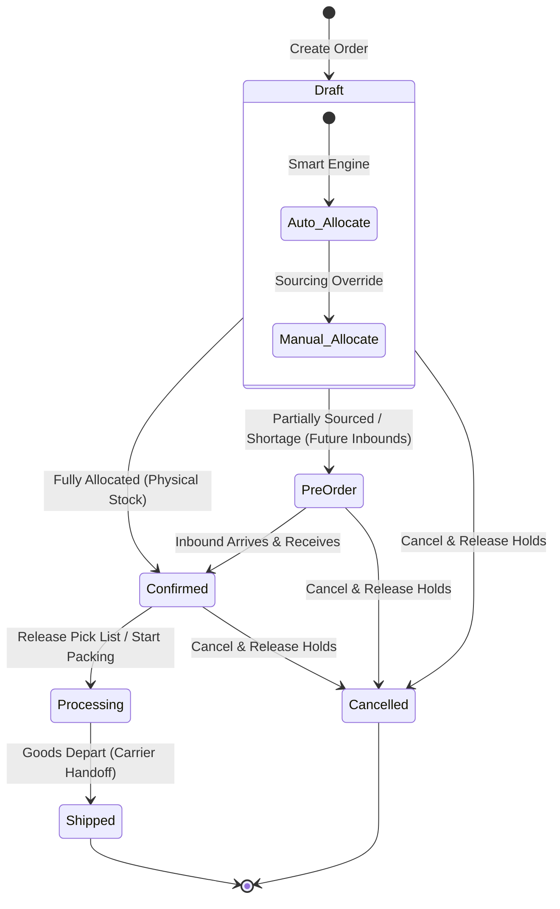

# Sales Order Lifecycle & Status Workflow

This document defines the lifecycle, state transitions, and business rules for the six statuses of a Sales Order (`SalesOrder.Status`) in the TJ Inventory system.

---

## 1. Core Status Definitions

### 1. Draft (`draft`)
* **Definition**: The planning and sourcing stage. The order is recorded in the system, but not yet committed to the warehouse floor or suppliers.
* **Behavior & Actions**:
  * Planners can fully edit order header fields (Customer, note, dates).
  * Planners can add, edit, or delete items inside the shopping cart.
  * The smart allocation engine dynamically matches items to physical stock lots (FEFO), arrivals, or logs shortages.
  * Planners have full access to the **Manual Sourcing Workspace** to customize holds.
  * The order can be cleanly **Cancelled** at any time.

### 2. Pre-order (`preorder`)
* **Definition**: The customer order is formally accepted, but it **cannot be fully satisfied by physical stock on hand**. Sourcing relies on future procurement expected arrivals or supplier purchase orders ( shortages ).
* **Behavior & Actions**:
  * Item edits and quantities are locked.
  * Expected arrivals are reserved to this order document. Remaining gaps are recorded in the material shortages ledger.
  * Can be **Cancelled** (which purges all arrival holds and dynamic pending shortages).
  * Automatically transitions to **Confirmed** once all dynamic shortage lines are addressed and matching expected arrivals are marked as `Received` (adding to actual physical balances).

### 3. Confirmed (`confirmed`)
* **Definition**: Sourcing is 100% complete. **Every single item line is fully allocated with actual physical stock lots on hand** in the warehouse. Sourcing gaps and shortages are zero.
* **Behavior & Actions**:
  * The order is ready for warehouse release.
  * Inventory is strictly committed in the database (`reserved_qty` is increased on physical stock records).
  * Can be **Cancelled** (releasing physical locks to restore available warehouse stock balances).

### 4. Processing (`processing`) — *Picking & Packing*
* **Definition**: The operational bridge between planning and logistics. **The order has been handed off to the warehouse floor for physical execution**.
* **When to transition to `processing`**:
  * Transition a `CONFIRMED` sales order to `PROCESSING` when:
    1. A warehouse stock controller prints the **Pick Slips** or **Packing Slips**.
    2. Physical stock picks are actively assigned to warehouse floor operators.
    3. The goods are being gathered from aisles, verified, packaged, or boxed at staging stations.
* **Why this state is critical**:
  * **Edits Blocked**: It prevents planners from editing or canceling an order in the office while a warehouse operator is already holding the items on the floor.
  * **Inventory Security**: It signifies that the stock is no longer on shelves, preventing stockouts or double-picking during physical operations.
  * **Logistics Tracking**: Gives sales reps real-time visibility that the order is actively being prepared for delivery.

### 5. Shipped (`shipped`)
* **Definition**: Sourcing is finalized. The carrier has physically loaded the packages, and the goods have departed the warehouse.
* **Behavior & Actions**:
  * Physical stock reservation holds are permanently deleted, and the actual stock balance is deducted in the ledger (`balance = balance - quantity`).
  * Status becomes read-only and locked forever.

### 6. Cancelled (`cancelled`)
* **Definition**: The transaction is terminated.
* **Behavior & Actions**:
  * Releases all physical stock reservations, procurement arrival pre-allocations, and deletes pending dynamic shortages cleanly.
  * Locked forever.

---

## 2. State Transition & Capabilities Matrix

The following matrix defines what actions are permitted in each status stage:

| Sales Order Status | Item/Qty Edits | Manual Sourcing Workspace | Smart Allocator Auto-Refresh | Soft-Document Attachments | Accidental Cancellation | Physical Balance Deducted |
| :--- | :---: | :---: | :---: | :---: | :---: | :---: |
| **Draft** | Yes | Yes | Yes | Yes (Add/Remove) | Instant | No |
| **Pre-order** | No | Yes | Yes | Yes (Add/Remove) | Double-Opt-In | No |
| **Confirmed** | No | Yes | Yes | Yes (Add/Remove) | Double-Opt-In | No |
| **Processing** | No | No | No | Yes (View Only) | Restricted | No |
| **Shipped** | No | No | No | Yes (View Only) | Blocked | Yes (Deducted) |
| **Cancelled** | No | No | No | Yes (View Only) | N/A | No (Released) |

---

## 3. Recommended Implementation Paths for "Processing"

To implement the operational `PROCESSING` workflow in the sales application, we recommend creating a secure action handler:

1. **Warehouse Release Controller**:
   * Add a POST action button **"Release to Warehouse"** (gated under `warehouse.change_stock` or `sales.change_salesorder` permissions) visible on the detail page when the status is `CONFIRMED`.
   * Triggering this action updates the status to `PROCESSING` and generates a printable pick slip.
2. **Cancellation Gating**:
   * If a planner attempts to cancel an order that is `PROCESSING`, show a warning explaining that pick slips must be rolled back on the warehouse floor first, requiring supervisor authorization before returning the order to `CONFIRMED` or `CANCELLED`.