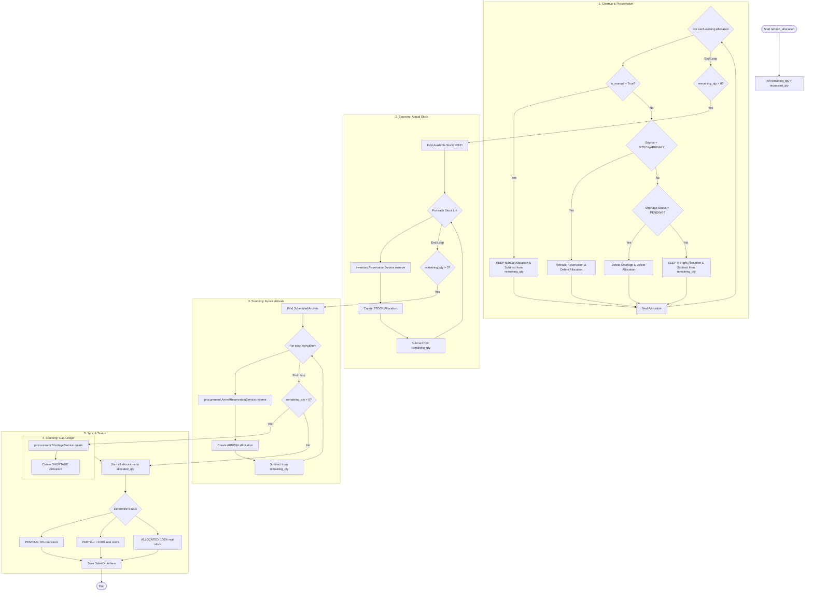

# Sales Allocation Service: Deep Dive

The `SalesService.refresh_allocation` method is the core engine of our **Triple-Ledger Reservation System**. It ensures that every item on a Sales Order is accounted for, using a waterfall priority while respecting user-manual choices and procurement commitments.

## Allocation Flowchart

## Core Concepts

### 1. Manual vs. Auto Allocation
- **Manual Selection (`is_manual=True`)**: This is the "Shopping Cart" mode. A Sales person picks specific lots or shipments. The system **never** re-calculates or deletes these. They are treated as fixed commitments.
- **Auto Allocation (`is_manual=False`)**: The system automatically fills gaps using FEFO (First-Expired, First-Out). These are "Volatile" and will be re-calculated if a better lot arrives.

### 2. Sourcing Priority (Waterfall)
The engine acts as a **Gap Filler**:
1. **Preserve Fixed Commitments**: Start with `requested_qty` and subtract any Manual picks and In-Flight shortages.
2. **Fill from Stock**: Find available physical lots for the remaining balance.
3. **Fill from Arrivals**: Find incoming shipments if stock is empty.
4. **Fill from Shortage**: Create a gap record if no stock or arrivals are available.

### 3. In-Flight Protection
- **Shortages with POs**: If a shortage has reached `po_created` status, it is preserved. We assume the Procurement team is already working on it, and we shouldn't change their plan.

### 4. Surplus Handling (Cancellation/Reduction)
If an order is reduced below the quantity of a Manual or In-Flight allocation:
- **Manual Reduction**: The system will keep the manual pick up to the new `requested_qty`.
- **Orphaned Shortage**: If the order is cancelled, processed shortages are detached and marked as `[ORPHANED]` in Procurement to signal surplus stock.

## Why this is Robust
- **Hybrid Control**: Gives users control over specific lots while automating the bulk of the work.
- **Orchestration**: The Service Layer manages the complex coordination between three apps (Sales, Inventory, Procurement).
- **Data Integrity**: Uses atomic transactions and explicit service calls to ensure quantity synchronization across all ledgers.
