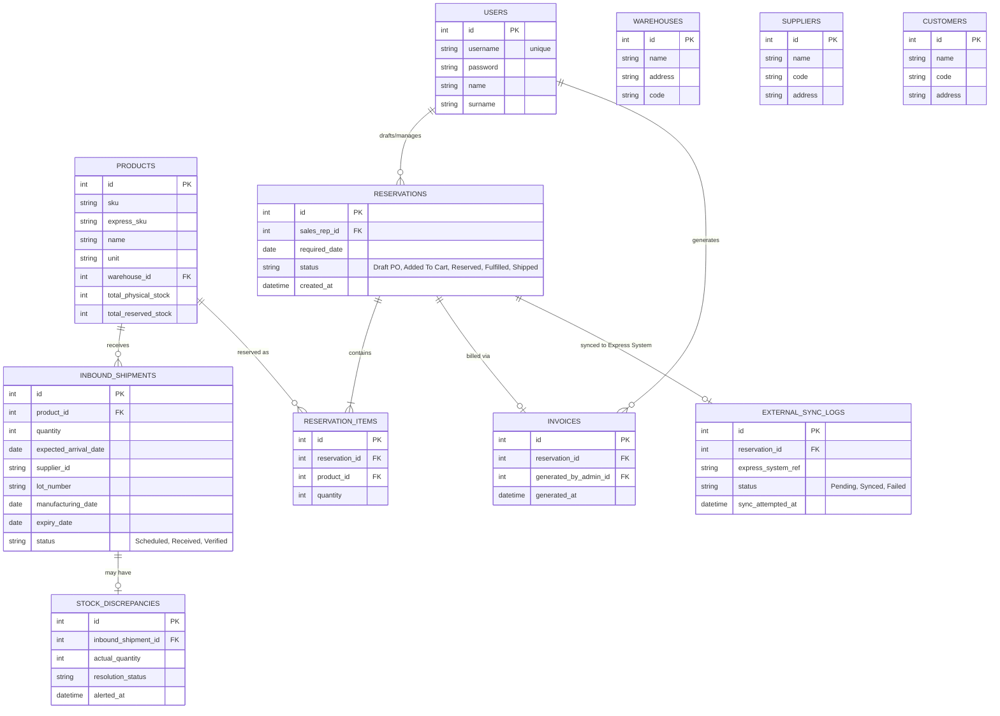

# Inventory Preorder System ERD

Here is the complete Entity-Relationship Diagram for your **Inventory Preorder System**, rendered natively using Mermaid.js. 

You can view it right here in the chat, or copy the raw markdown block below into any supported platform (GitHub, Notion, Obsidian, Cursor, etc.).

> [!NOTE]  
> **Global Audit Fields**  
> To keep the diagram clean and readable, the following fields are omitted from the boxes above, but are assumed to exist on **every** table (or all major tables) as standard mixins:
> * `string note`
> * `string status` (Active/Inactive)
> * `datetime created_at`
> * `int created_by FK`
> * `datetime updated_at`
> * `int updated_by FK`
> * `datetime deleted_at` *(nullable)*
> * `int deleted_by FK` *(nullable)*

## Table Reference

* **`INBOUND_SHIPMENTS`**: Tracks scheduling to verification.
* **`STOCK_DISCREPANCIES`**: Captures differences between Expected and Actual Receiving quantities.
* **`RESERVATIONS`**: Manages the core PO / fulfillment lifecycle.
* **`RESERVATION_ITEMS`**: Specific product lines allocated to a reservation.
* **`EXTERNAL_SYNC_LOGS`**: Centralizes logging for integration with the external "Express" system.
